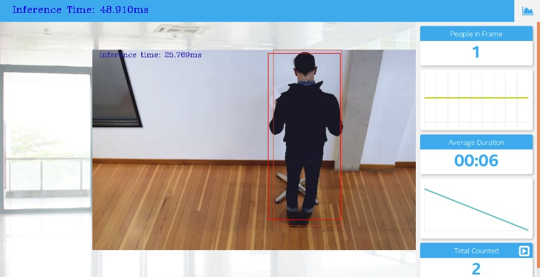

# Project Write-Up

## Explaining Custom Layers

The process behind converting custom layers involves creating intermediate representation for layers not officially supported by OpenVINO.

To add them, extensions for both the Model Optimizer and Inference Engine are needed. The model extension generator that comes with OpenVINO generates template source files for each extension needed. The functions may need to be edited to create specialized extension source code. After that we use the Model Optimizer to convert and optimize the model into IR files that will run inference using the Inference Engine.

There are a few different steps depending on the framework of origin. In TensorFlow for example an option is to register the custom layers as extensions to the Model Optimizer. Another option is to replace the unsupported subgraph with a different subgraph. A third option is to actually offload the computation of the subgraph back to TensorFlow during inference.

## Model Selection

The model chosen was [Tensorflow SSD_Mobilenet_V2_Coco](https://github.com/tensorflow/models/blob/master/research/object_detection/g3doc/tf1_detection_zoo.md) . The reason was because it's considered fast running with low time inferences . At Tensorflow Model Zoo the time benchmarked is 31ms infer time (gpu).

The command-line used for conversion was

```bash
python /opt/intel/openvino/deployment_tools/model_optimizer/mo.py --input_model frozen_inference_graph.pb --tensorflow_object_detection_api_pipeline_config pipeline.config --reverse_input_channels --tensorflow_use_custom_operations_config /opt/intel/openvino/deployment_tools/model_optimizer/extensions/front/tf/ssd_v2_support.json
```

## Comparing Model Performance

My method(s) to compare models before and after conversion to Intermediate Representations
was to load the preconverted model in Tensorflow and run it in a single frame image available at images folder.  
The script is in the file `preconverted_model_run.py` found at this folder

The difference between model accuracy pre- and post-conversion was minimal after conversion.
Pre-conversion Time average : 48.95370006561279 ms  
Post-conversion: 48.910ms


The size of the model pre-conversion was 69.7 MB and post-conversion was 67.5 MB

In terms of network needs and costs , the use of Edge Computing Technology represents economy compared with cloud where the user would be charged as they use the resources. Using Edge computing the user would invest once in the hardware acquisition. Processing the data locally also make it less prone to network problems that can happen and also require less bandwith which can eventually mean a lower cost internet plan.

## Assess Model Use Cases

Some of the potential use cases of the people counter app are:

1. Count the number of people that enter and leave a shop each unit of time, for evaluation of best hours of the day for sellings. A line can be traced in the frame and person direction saved by observing if box is behind or after the line to compute whether a person is entering or leaving the shop. The information obtained can be matched with sellings to calculate conversion ratio for example.

2. In an epidemic scenario like 2020, it can be used to monitor max people allowed in an area like a beach or public square by counting number of people in the frame. It can also be calculated the distance between boxes to see if people is respecting social distance.

3. Urban Planning . The app can be used with cameras installed in city to monitor areas with more and less movement of people by counting number of people in every hour of the day to decide new potential commerce hubs for example, also transportation lines could be verified with the same measure too see which lines and stations are overloaded and could benefit with new lines.

## Assess Effects on End User Needs

Lighting, model accuracy, and camera focal length/image size have different effects on a
deployed edge model. The potential effects of each of these are as follows.

It was verified through web cam use that in a low light room that the model have pretty good detection performance, so lighting doesn't affect it very much. Of course it can not be completely dark or white but small variations doesn't affect it.

The model doesn't lose accuracy after conversion which is good but it was verified that many times the detection score falls below the threshold. I kept this boxes drawn in the app with different color and showing the accuracy. This information can still be used for tracking if boxes disappeared might still be present near previous location. More models could be tested and also trained for specific situations in a real world application.

About image size the web cam tested has resolution 1280 x 720 , larger than the demo video which has 768 x 432. The effect it can have is higher network bandwith needed to transmit the processed image to the server. The camera focal length to be chosen depends totally on the user need for wide or narrow angle of view.
